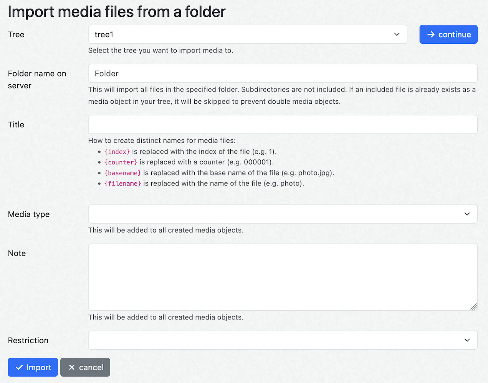

# Webtrees media folder import module

This webtrees module adds the possibility to import all media files in the same folder at once from within the admin panel.

## Installation

Download an archive of [the latest release](https://github.com/garraflavatra/webtrees-media-folder-import/releases/latest) and unzip it into the `modules_v4` folder of your webtrees installation. Subsequently, enable it in the administration panel using the "All modules" link in the "Modules" section.

## Usage

Go to the administration panel, select a tree and click on the "Media object" link under "Add unlinked records". Select "An entire folder on the server".

You can now specify the name of the folder which contains the files that you want to import. Subdirectories are not included. If an included file is already exists as a media object in your tree, it will be skipped to prevent double media objects. It's also possible to search for a folder by using the autocomplete feature.

Additionally, specify the title you want to give your imported media objects. The following replacements will be performed:

* `{index}` is replaced with the index of the file (e.g. 1).
* `{counter}` is replaced with a counter (e.g. 000001).
* `{basename}` is replaced with the base name of the file (e.g. photo.jpg).
* `{filename}` is replaced with the name of the file (e.g. photo).

You can optionally specify additional fields (i.e. media type, notes and restriction) that will be the same for all imported files.

## Author & license

© [Romein van Buren](mailto:romein@vburen.nl) 2023.

This program is free software: you can redistribute it and/or modify it under the terms of the GNU General Public License as published by the Free Software Foundation, either version 3 of the License, or (at your option) any later version. This program is distributed in the hope that it will be useful, but WITHOUT ANY WARRANTY; without even the implied warranty of MERCHANTABILITY or FITNESS FOR A PARTICULAR PURPOSE. See the GNU General Public License for more details. You should have received a copy of the GNU General Public License along with this program. If not, see <https://www.gnu.org/licenses/>.
